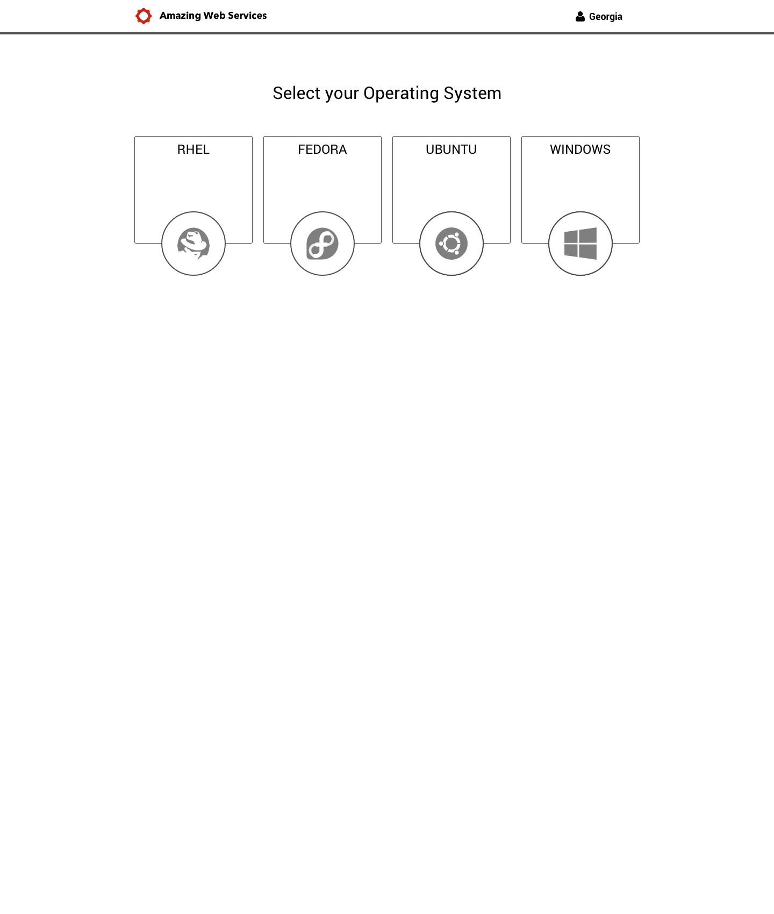
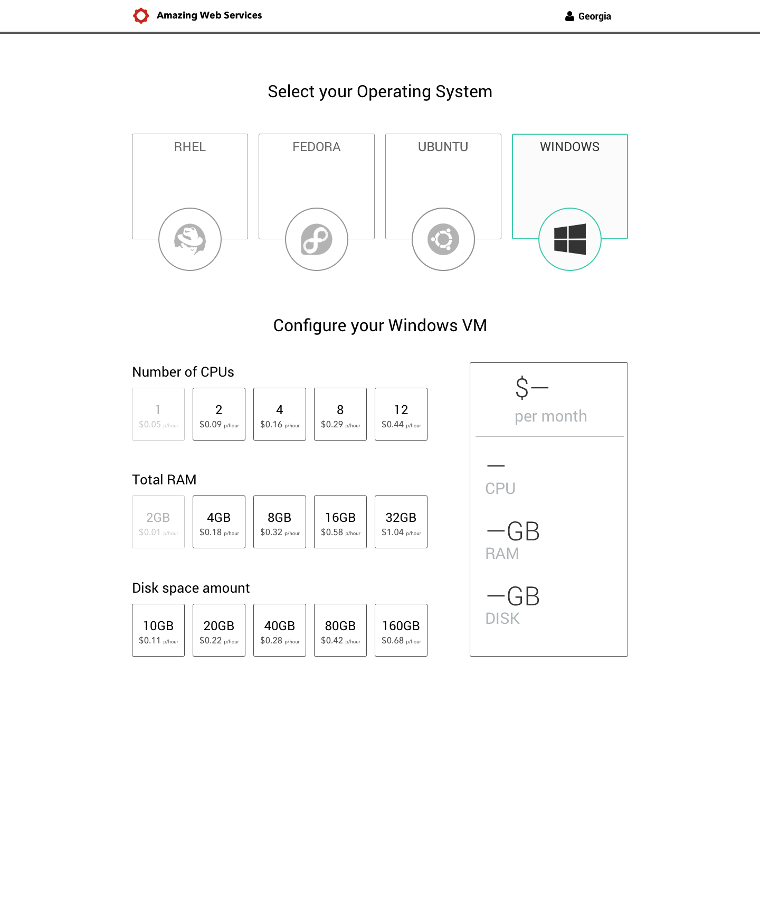
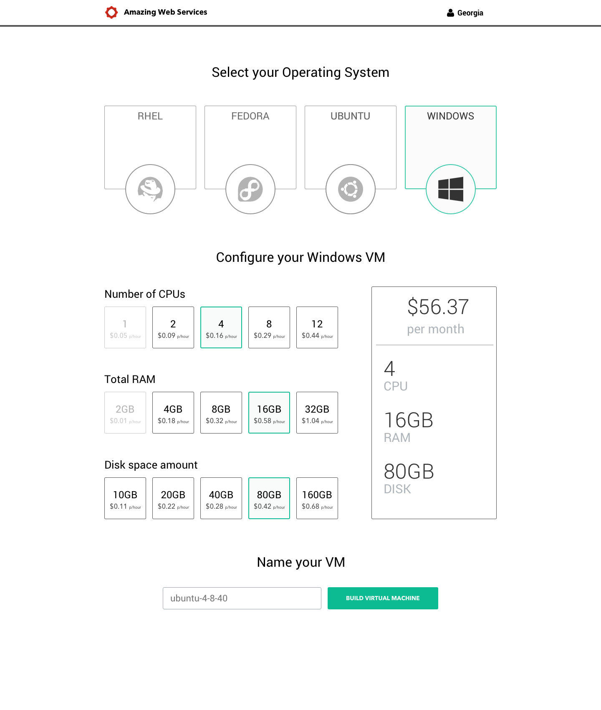

# Amazing Web Services
## A PromptWorks mock app

We are building a (fictional) new cloud infrastructure service and calling it Amazing Web Services. With it, users can provision virtual machines to use as web servers.

Think Digital Ocean, except slower.

The back-end has already been implemented and your job is to build (part of) a user interface that allows users to understand our offerings and spin up new servers with ease.

## Your task
Build a functional user interface for the "Configure a New VM" screen, as shown below in the design mockups. This screen should account for all states in the process of configuring a virtual maching:
- Selecting an operating system
- Selecting the number of CPUs
- Selecting the amount of RAM
- Selecting the amount of disk space
- Reporting the calculated price based on the above choices

Please note you are **not required** to actually implement the creation of a VM via the API. Nor should you be concerned about additional screens. We are only tasking you with creating this single interface.

A very simple web application has already been setup for you. We've gone ahead and stubbed out a few things:
- Local application development setup with [Parcel](https://parceljs.org/)
- Basic empty components for React and Vue apps. Choose one, or implement something else if you prefer.
- An API method to fetch the pricing data you'll need. You can find the `fetchPrices` method in `src/api.js`. Please note, this is an asynchronous method that returns a Promise, so you'll have to resolve it as such.

*Please be sure to read the API documentation below for some crucial information about how Amazing Web Services works.*

## Start building

You must have [Git](https://git-scm.com/) and [Yarn](https://yarnpkg.com/en/) installed on your computer.

Clone this repository:
`git clone git@github.com:promptworks/amazing-web-services.git`

Install dependencies:
`yarn install`

Compile and run the app:
`yarn start`

# The Amazing Web Services API

You can hit the API here: https://suitor-front-end-back-end.herokuapp.com

_Please note, you don't actually need to implement any additional API requests to complete your assignment. Documentation is here for your information, and to help you make decisions about the UI you build._

## API Documentation

### Authorization

You'll need to plug in an API key in `src/api.js`. Visit [https://suitor-front-end-back-end.herokuapp.com/api_key](https://suitor-front-end-back-end.herokuapp.com/api_key) to get one. Don't worry about keeping it a secret.

### VM Endpoints
#### `POST /vms`
Use this endpoint to create VMs.
*Please note that some configurations are not valid.* Here are the restrictions on configurations:
- Windows machines must have at least 2 vCPUs and at least 4GB RAM
- RHEL machines cannot have more than 4 vCPUs
- Fedora machines cannot have more than 2GB RAM

##### Required parameters:
- `name (string):`
The name of the VM.
For technical reasons, this name must be unique across the entire database.
If another VM exists with the same name, you will receive an error.

- `vcpu (int):`
The number of virtual CPUs.
Acceptable values are provided by /prices/vcpu endpoint.

- `ram (int):`
RAM, in gigabytes.
Acceptable values are provided by /prices/ram  endpoint.

- `os (string):`
The OS to put on the VM
Acceptable values are provided by `/prices/os` endpoint.

- `disk (int):`
The size of the VM's hard drive, in gigabytes.
Acceptable values are provided by `/prices/disk` endpoint.

For technical reasons, if the API receives a vcpu, ram, os, or disk parameter that is not valid, or an invalid combination of them, the API may take longer to respond.

#### `GET /vms`
Returns a list of virtual machines.

#### `DELETE /vms`
Deletes all virtual machines for a given "API-Key".

### Pricing Endpoints

All pricing numbers are in cents/hour.

#### `GET /prices/vcpu`
Returns valid options for number of vCPUs and their corresponding prices.
```
{
    "1": 0.5,
    "2": 0.9,
    "4": 1.6,
    "8": 2.9,
    "12": 4.4
}
```

#### `GET /prices/ram`
Returns valid options for number of GB of RAM and their corresponding prices.
```
{
    "2": 1,
    "4": 1.8,
    "8": 3.2,
    "16": 5.8,
    "32": 10.4
}
```

#### `GET /prices/disk`
Returns valid options for number of GB of disk space and their corresponding prices.
```
{
    "10": 1.1,
    "20": 2.2,
    "40": 2.8,
    "80": 4.2,
    "160": 6.8
}
```

#### `GET /prices/os`
Returns valid choices for OS and their corresponding prices.
```
{
    "windows": {"base": 0,   "vcpu": 0.7},
    "rhel":    {"base": 0.5, "vcpu": 0},
    "fedora":  {"base": 0.1, "vcpu": 0.2},
    "ubuntu":  {"base": 0,   "vcpu": 0}
}
```

In this example:
- Windows OS will cost an additional 0.7 cents per hour for each vCPU that the machine has.
(So, if the machine has 4 vCPUs, using Windows will cost 2.8 cents/hour more than Ubuntu would)
- RHEL will cost 0.5 cents per hour for the privilege of using RHEL as your OS.
- Fedora will cost 0.1 cents per hour, plus 0.2 cents/hour for each vCPU.
(So, if the machine has 4 vCPUs, using Fedora will cost 0.9 cents/hour (`0.2*4+0.1`) more than Ubuntu would)

Note that these prices are in **addition to** the price per vCPU as described by the /prices/vcpu endpoint.


## Design

A set of wireframes have been created for this application detailing the three step process on creating a new Virtual Machine:

1. Select the Operating System
1. Configure the Virtual Machine
1. Name the Virtual Machine

## Select the Operating System


## Configure the Virtual Machine


## Name the Virtual Machine



